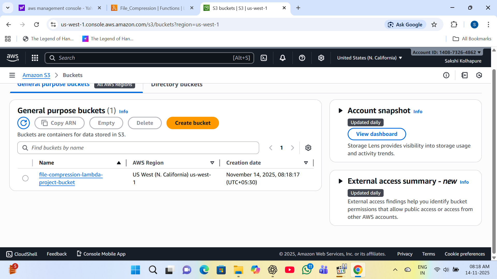
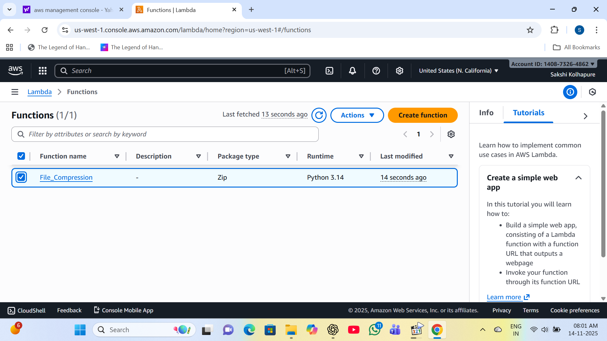
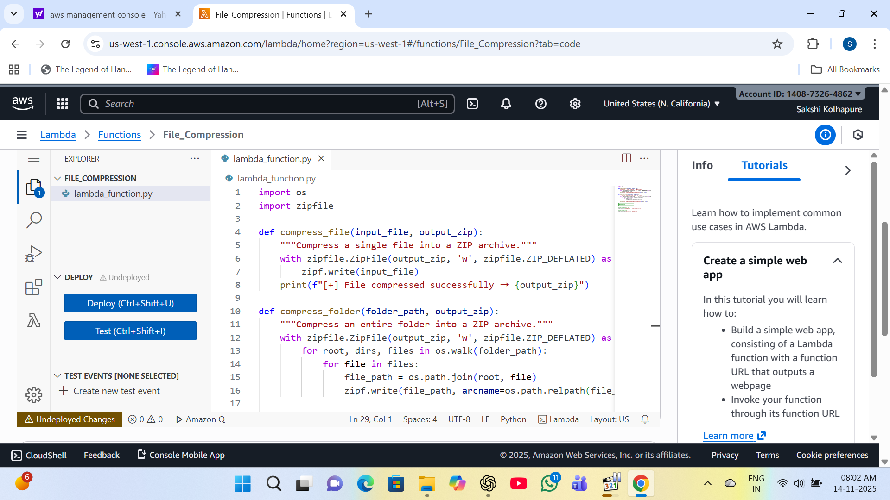
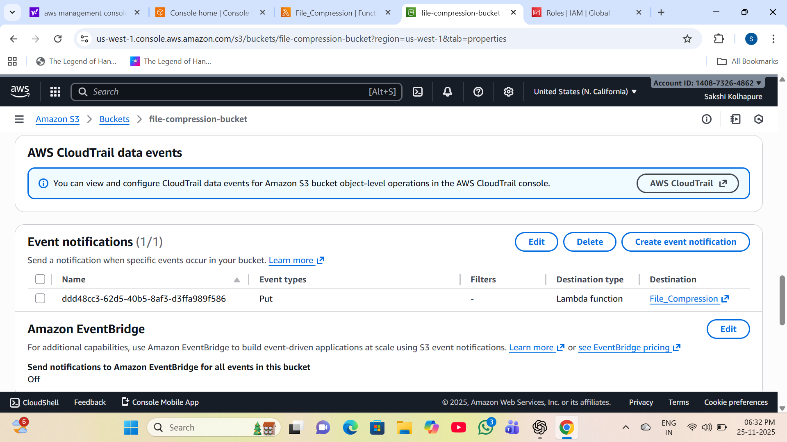
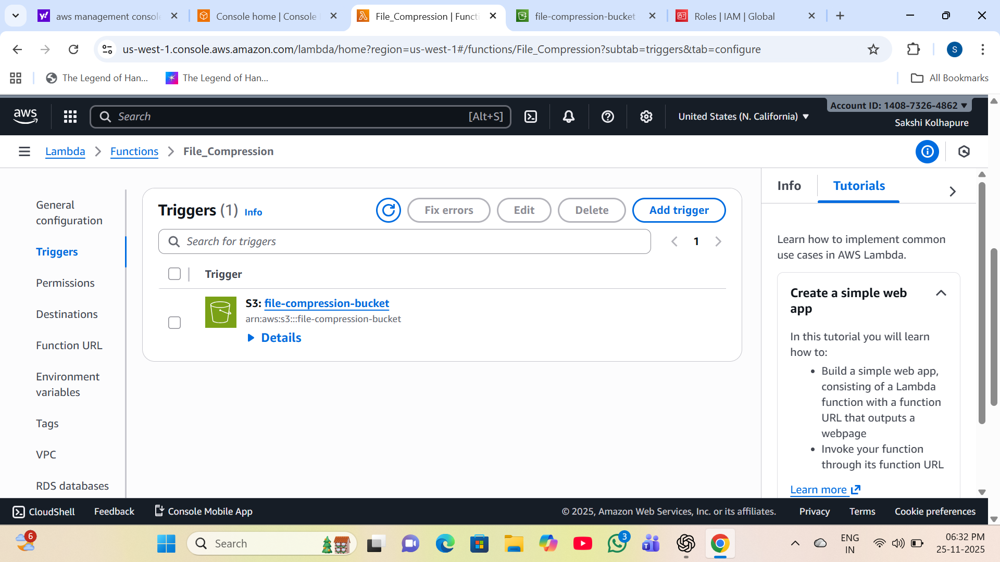
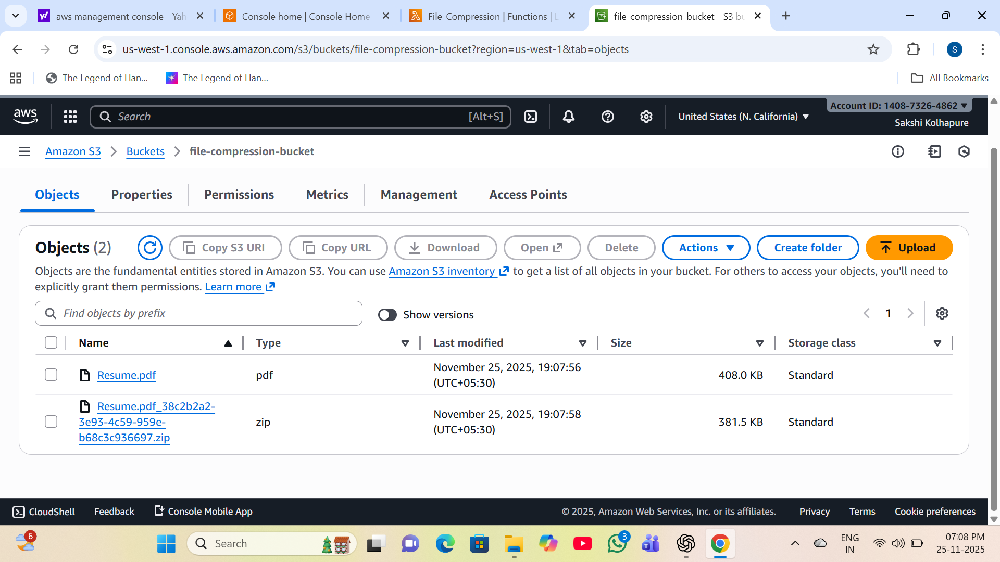

# Serverless File Compression Project

#### This project implements a serverless file compression solution on AWS. Files uploaded to an Amazon S3 bucket are automatically compressed using AWS Lambda and stored back in S3. The solution is event-driven, cost-effective, and requires no server management.

## Features

- Fully serverless architecture

- Automatic file compression on upload

- Supports multiple file types

- Cost-efficient and scalable

- Secure and event-driven

## Step-by-Step Implementation

### Step-1:Create one S3 bucket

### Step-2: Create a Lambda Function

### Step-3:Write the Lambda function to compress uploaded files

### Step-4:Configure S3 event notifications

### Step-5: Add Trigger to Lambda Function

### Step-6:Upload a file to the input bucket and Verify the compressed file appears in the same bucket

- SNS notify success notification after file compression

## Conclusion

This serverless file compression project demonstrates how AWS services can be combined to create an efficient, scalable, and automated solution without managing servers. It is ideal for data pipelines, storage optimization, and cost reduction use cases.

